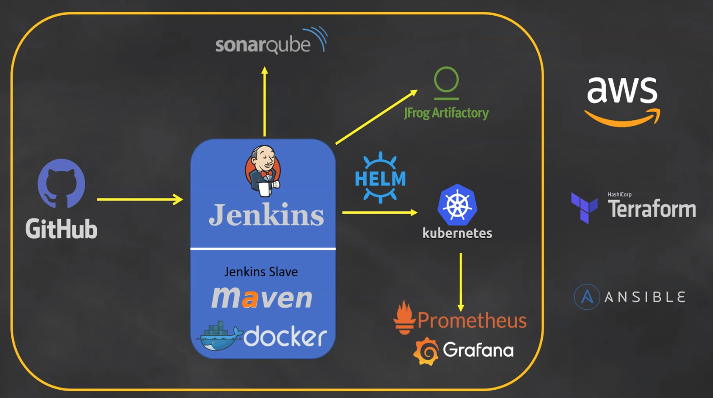
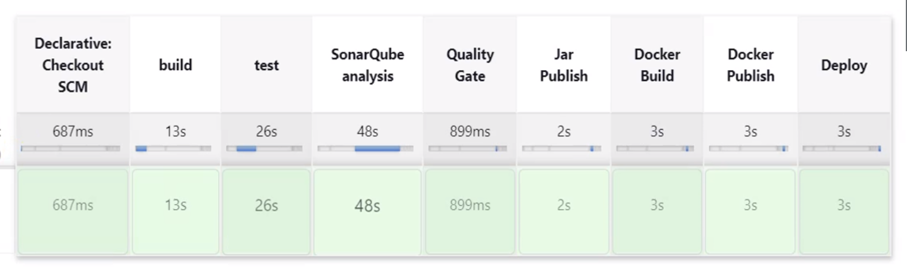

# E2E DevOps Project

This project demonstrates a comprehensive end-to-end DevOps pipeline, leveraging multiple tools and technologies to streamline and enhance the continuous integration and continuous delivery (CI/CD) processes.

## Architecture Diagram

## Project Overview

### Infrastructure Provisioning

- **Terraform**: Used to provision the core infrastructure, including :
- 1- Jenkins master, build node, and Ansible servers. 
- 2- EKS cluster associated with the necessary roles and policies, ensuring a scalable and maintainable environment.
- **AWS**: Cloud platform for infrastructure deployment.

### Configuration Management

- **Ansible**: Configured to manage and automate the setup of Jenkins master, build node, and their dependencies enhancing operational efficiency.

### CI/CD Pipeline

- **Jenkins**: Central to the CI/CD pipeline, orchestrating builds, tests, and deployments.
- **GitHub**: Integrated with Jenkins for source code management and web-hooks for automated triggering of CI/CD processes.

### Code Quality and Artifact Management

- **Maven**: Employed for building and managing the application and its dependencies.
- **SonarQube**: Integrated for code quality analysis, defining rules and gates to enforce high-quality coding standards.
- **JFrog Artifactory**: Used for efficient storage and management of build artifacts, including Docker images.

### Containerization and Orchestration

- **Docker**: Used for containerizing application.
- **Kubernetes**: Provisioned using Terraform, with deployments managed via **Helm** charts for efficiency and repeatability.

### Monitoring and Observability

- **Prometheus and Grafana**: Set up using Helm charts to monitor the Kubernetes cluster, implementing detailed monitoring and alerting mechanisms to ensure system reliability and performance.

## CI/CD Pipeline Overview

## Pipeline Steps

   **Jenkins Pipeline Setup**:
   - Developed a Jenkinsfile from scratch to build, test, push and deploy the application. 
   - Implemented a multi-branch pipeline.
   - Enabled GitHub web-hooks for automated CI/CD triggering.

   **Code Quality Assessment**:
   - Configured SonarQube and Sonar scanner.
   - Executed SonarQube analysis.
   - Defined rules and gates within SonarQube.
   - Set up Sonar callback rules.

   **Artifact Management**:
   - Configured JFrog Artifactory.
   - Built the application with Maven and pushed Jar to JFrog
   - Created Dockerfile for containerization.
   - Stored Docker images on JFrog Artifactory.

   **Kubernetes Deployment**:
   - Provisioned a Kubernetes cluster (ُEKS) using Terraform.
   - Deployed Kubernetes objects with Helm.

## Conclusion

This project has significantly enhanced our infrastructure's automation, reliability, and scalability, paving the way for faster and more efficient software delivery. The integration of these tools and practices ensures a robust and maintainable DevOps pipeline, ready to adapt to future needs.

## Connect

Feel free to reach out if you have any questions or need further information about this project!

#DevOps #Terraform #Jenkins #Ansible #Kubernetes #CI/CD #SonarQube #JFrogArtifactory #Prometheus #Grafana #Automation #IAC #CodeQuality #Docker #Git #Cloud #Maven #Helm #AWS #SRE